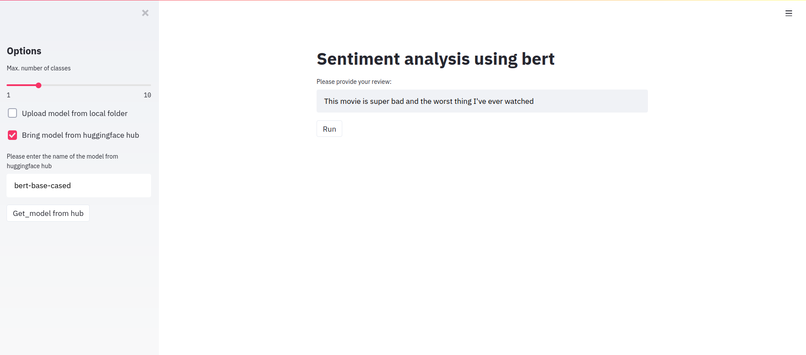

# Sentiment_analysis_with_bert
This repository uses bert model with custom dataset from class BertModel. It is about classifying the reviews scraped from google play according to positive, neutral or positive review.

